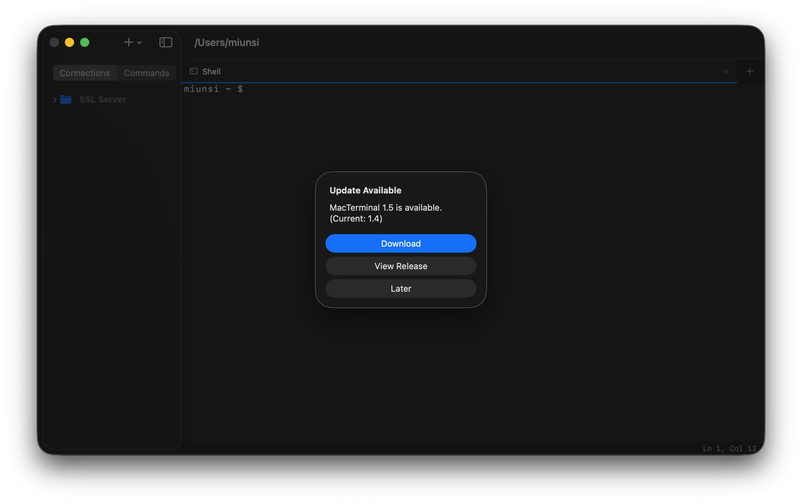

# MacTerminal

A native macOS terminal emulator built with SwiftUI + AppKit.


## Features

- **Terminal Emulation** — Full pseudoterminal (`forkpty`) with `xterm-256color` support
- **Tabs** — Multi-tab interface with drag & drop reordering (Cmd+T / Cmd+W)
- **Split View** — Side-by-side terminal panes within a tab (Cmd+D / Cmd+Shift+D to close)
- **SSH Bookmarks** — Tree-structured connection manager with folders and subfolders
- **SSH Auto-Password** — Automatically detects SSH password prompt and sends stored password (one-shot)
- **Commands** — Save frequently used commands and double-click to auto-input into terminal
- **Right-Click Copy/Paste** — Right-click to copy selection or paste if no selection
- **Background Tab Updates** — Tabs continue processing data even when not focused, with blink indicator for unread output
- **Status Bar** — Bottom bar showing cursor position (Ln, Col) and selection range
- **Drag & Drop** — Reorder bookmarks and move them between folders
- **Find** — In-terminal search with next/previous navigation (Cmd+F)
- **Recording** — Record terminal sessions to text files
- **Save Output** — Export terminal content to file (Cmd+S)
- **Customization** — Configurable font, background color, and text color
- **Block Selection** — Toggle block selection mode for text
- **Multi-Window** — Detachable terminal windows
- **Working Directory** — Starts in home directory; new tabs inherit current directory
- **Auto Update** — Checks for new releases via GitHub Releases API

## Screenshots



## Install

Download `MacTerminal.dmg` from [Releases](https://github.com/secondlook-hub/MacTerminal/releases), or grab it directly from the repository.

## Build from Source

```bash
git clone https://github.com/secondlook-hub/MacTerminal.git
cd MacTerminal
xcodebuild -scheme MacTerminal -configuration Release build
```

Requires **Xcode 15+** and **macOS 13.0 Ventura** or later.

## Keyboard Shortcuts

| Shortcut | Action |
|----------|--------|
| Cmd+T | New Tab |
| Cmd+W | Close Tab |
| Cmd+D | Split View |
| Cmd+Shift+D | Close Split View |
| Cmd+F | Find |
| Cmd+S | Save Shell Content |
| Cmd+K | Clear Scrollback |
| Cmd+C | Copy (with selection) |
| Cmd+V | Paste |
| Right-Click | Copy selection / Paste (no selection) |

## Project Structure

```
MacTerminal/
├── MacTerminalApp.swift          # App entry point, menu commands
├── ContentView.swift             # Main layout (sidebar + terminal)
├── Models/
│   ├── SplitNode.swift           # Split view tree model (pane / split node)
│   ├── SSHBookmark.swift         # SSH connection data model
│   ├── SSHBookmarkStore.swift    # Tree-based bookmark persistence
│   ├── SidebarItem.swift         # Tree node (folder / bookmark leaf)
│   ├── CommandItem.swift         # Saved commands model & persistence
│   ├── TerminalTab.swift         # Tab & split pane state management
│   ├── UpdateChecker.swift       # GitHub Releases update checker
│   └── WindowManager.swift       # Multi-window tracking
├── Terminal/
│   ├── PseudoTerminal.swift      # PTY process management (forkpty)
│   └── TerminalScreen.swift      # Terminal rendering engine
└── Views/
    ├── SplitTerminalView.swift   # Recursive split view renderer
    ├── SidebarView.swift         # Tabbed sidebar (Connections + Commands)
    ├── SSHBookmarkEditView.swift # Bookmark add/edit form
    ├── CommandEditView.swift     # Command add/edit form
    ├── TabBarView.swift          # Tab bar with drag reordering
    ├── TerminalView.swift        # NSViewRepresentable terminal bridge
    └── DetachedWindowContent.swift
```

## License

MIT
