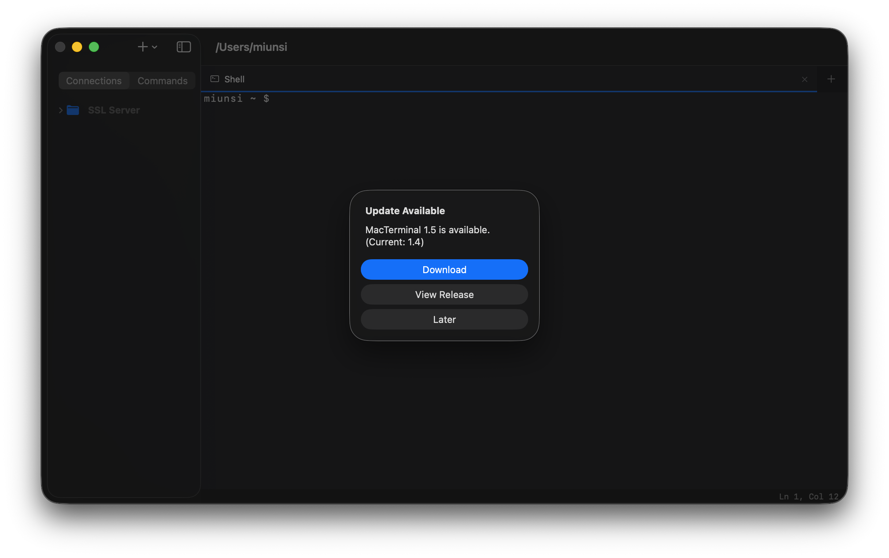

# MacTerminal

A native macOS terminal emulator built with SwiftUI + AppKit.


## Features

- **Terminal Emulation** — Full pseudoterminal (`forkpty`) with `xterm-256color` support
- **Tabs** — Multi-tab interface with drag & drop reordering (Cmd+T / Cmd+W)
- **Split View** — Side-by-side terminal panes within a tab (Cmd+D / Cmd+Shift+D to close)
- **SSH Bookmarks** — Tree-structured connection manager with folders and subfolders
- **SSH Auto-Password** — Automatically detects SSH password prompt and sends stored password (one-shot)
- **Commands** — Save frequently used commands and double-click to auto-input into terminal
- **Right-Click Copy/Paste** — Right-click to copy selection or paste if no selection
- **Background Tab Updates** — Tabs continue processing data even when not focused, with blink indicator for unread output
- **Themes** — Dark, Gray, and Light themes with sidebar support (View > Theme)
- **Line Numbers** — Toggle line numbers on the left side (View > Show Line Number)
- **Timestamps** — Per-line timestamps on the right side, independent per tab/window (View > Show Timestamp)
- **Logical Line Tracking** — Wrapped lines are treated as a single logical line for line numbers and timestamps
- **Settings Export/Import** — Export and import connections, commands, theme, and color settings (File > Settings)
- **Folder State Persistence** — Sidebar folder expanded/collapsed state remembered across restarts
- **Font Zoom** — Cmd + Mouse Wheel or View menu (Text Bigger/Smaller/Default Size) to resize terminal font instantly (8pt–72pt, Cmd+Plus/Minus/0)
- **NFC Normalization** — File drag & drop and clipboard paste use NFC Unicode form (fixes Korean filenames)
- **Text Wrap Toggle** — Turn text wrapping on/off with horizontal scrolling (View > Text Wrap)
- **Smart Double-Click** — Double-click selects text between 2+ consecutive spaces (selects phrases, not just words)
- **Status Bar** — Bottom bar showing logical line number (Ln) and column (Col) with selection range
- **Drag & Drop** — Reorder bookmarks and move them between folders
- **Find** — In-terminal search with next/previous navigation (Cmd+F)
- **Recording** — Record terminal sessions to text files
- **Save Output** — Export terminal content to file (Cmd+S)
- **Customization** — Configurable font, background color, and text color
- **Block Selection** — Toggle block selection mode for text (Cmd+B)
- **Multi-Window** — Detachable terminal windows with full terminal updates in detached windows
- **Clean Shell Exit** — `exit` command properly terminates shell and all child processes without freezing
- **Process Group Cleanup** — Tab close kills entire process group (shell + SSH + child processes)
- **Hidden Input Protection** — Non-echoed input (passwords, etc.) is not displayed in tab titles
- **Working Directory** — Starts in home directory; new tabs inherit current directory
- **Directory Tree** — Right-side panel showing filesystem tree from root; auto-refreshes and highlights on `cd`; double-click to change directory (View > Directory Tree)
- **Shell Integration** — Built-in zsh shell integration automatically reports current directory via OSC 7; directory tree highlights and scrolls to current directory on `cd`
- **Connection Double-Click** — Double-click SSH bookmarks to connect instantly
- **List Deselect** — Click empty area in connections/commands list to clear selection
- **Independent Terminal Identity** — Uses own `TERM_PROGRAM` identifier to prevent macOS from launching the default Terminal.app
- **Auto Update** — Checks for new releases via GitHub Releases API
- **Folder Access** — Prompts for Desktop, Documents, Downloads folder access on first launch
- **Rename Folder Sheet** — Improved folder rename UI with sheet dialog and keyboard support
- **Full Disk Access Check** — Checks Full Disk Access permission on launch; shows setup guide and opens System Settings if not granted
- **Korean IME Backspace Fix** — Single backspace deletes the last composing jamo (consonant) without requiring a second press
- **Input History** — View and search all previously entered commands (View > Input History, Cmd+Y); double-click to re-execute; optional auto-clear on app exit
- **Developer Website** — About panel shows developer blog link; Help menu includes "Visit Developer Website" to open in browser
- **Numeric Keypad Enter** — Numeric keypad Enter key works the same as the main Return key
- **Preserve Scrollback on Clear** — `clear` command and `\e[3J` only clear the visible screen; scrollback buffer is preserved (scroll up to see history)
- **Inline Korean IME** — Composing Hangul appears inline at the cursor position (like macOS Terminal.app) instead of a separate floating window
- **Per-Tab Timestamps** — Timestamp visibility is independent per tab and window; toggle affects only the current tab
- **Reorder Items** — Move Up/Move Down context menu for connections and commands list items
- **Crash Stability Fix** — Eliminated force-unwrap crashes on empty pane lists, fixed race conditions in PTY read handler with serial queue synchronization, thread-safe onChange callbacks
- **Memory Footprint Reduction** — Cursor blink now redraws only the cursor cell (not the whole view) and pauses while the window is inactive; 24-bit ANSI colors are deduped via NSCache; theme colors are computed once per theme change instead of on every property access; `inputBuffer` and recording-line buffers are bounded to prevent slow growth across long sessions
- **Wrap-Aware Copy** — Copying a selection that spans soft-wrapped lines pastes as a single logical line in other editors; line-wrap boundaries no longer inject spurious newlines
- **Native-Speed UI** — Tab switches reuse cached terminal views (scroll position, font, find-bar state preserved); the tab bar updates incrementally instead of rebuilding; PTY output is coalesced per runloop turn; sidebar list selection is instant via `Button(.plain)` + parallel double-tap; bookmark/command saves are debounced on a background queue; italic/bold-italic fonts are cached; plain glyphs draw without per-cell `NSAttributedString` allocation. Background-tab `hasUpdate` no longer broadcasts through `ObservableObject`, eliminating a per-PTY-chunk SwiftUI re-render storm
- **Long-Session Performance** — Sustained, output-heavy sessions stay responsive: the status bar's logical-line count is maintained incrementally instead of rescanning the entire scrollback on every refresh, and scrollback rows are stored trimmed of trailing blanks so memory tracks actual content. No-wrap mode no longer allocates 10,000-cell rows — the reported width is capped at a level real lines never reach
- **Background-Tab Responsiveness** — Tabs that aren't visible no longer run any display-refresh work (frame resize, scroll, status bar) on the main thread for every chunk of output — a hidden view never repaints anyway, so the visible tab keeps the main thread to itself even when several background tabs are spewing output. The revealed tab is brought current once on switch, the visible tab's refreshes are throttled to the display refresh rate, and a redundant per-chunk main-queue dispatch was removed
- **Multi-Day Session Performance** — Removes the gradual slowdown that built up over days of heavy use (a restart is no longer needed to recover): with line numbers/timestamps shown, the draw loop computes the first visible line's logical number in O(1) instead of rescanning the whole scrollback every frame; scrollback recycles row cell-buffers on scroll instead of allocating a fresh full-width row per line, cutting heap fragmentation; gutter (line-number/timestamp) fonts and attributes are cached instead of rebuilt per line per frame; and hidden tabs batch their output flushes so a busy background SSH session can't saturate the main thread and lag the foreground
- **Secure Tab Titles** — Tabs never display the running command (which can expose tokens, paths, or hosts). A tab shows its connection identity instead — the SSH bookmark/server name, or "Shell" for a local session — fixed at creation
- **Clearer Active Tab** — The selected tab is unmistakable: a distinctly elevated background (the old highlight was nearly identical to the bar), a thicker accent underline, and a semibold title
- **Robust Wrap-Aware Copy** — Line-mode copy joins a soft-wrapped logical line into a single line even when the wrap wasn't produced by autowrap (e.g. a full-width row drawn via explicit cursor moves), while genuinely separate lines — including full-width rows ended by a real newline — stay on their own lines. Block selection still copies exactly what's on screen
- **Terminal-Style Word Selection** — Double-click selects a single word the way macOS Terminal / iTerm do: a contiguous run of word characters — letters and digits (incl. CJK) plus path/identifier punctuation (`_ - . / + ~ \`) — so filenames, paths, flags, and dotted names select as one unit. A word double-click only triggers when the two clicks land on the same spot, so quick repositioning clicks no longer select a word by accident
- **Trimmed Copy** — Copied text has no leading or trailing whitespace or blank lines (a drag selection often grabs surrounding spaces); interior indentation is preserved
- **Scales with Long Scrollback** — Once the scrollback fills, output no longer slows down: row eviction is amortized to ~O(1) per line instead of shifting every parallel buffer on each line, and refreshes invalidate only the visible viewport instead of the full (thousands-of-rows-tall) document, so redraw cost stays constant no matter how long the scrollback gets
- **No Crash on Exiting a Full-Screen Program** — Quitting vim/less/top (or an SSH session that restores the main screen) no longer kills the app when the pane had been resized meanwhile — which happens routinely just by closing another tab and letting the layout reflow. The saved main-screen buffer is now resized along with the visible one, and the screen buffer self-heals if its geometry is ever out of step, so writes can't run past the end of a stale grid
- **Wrapped Lines Ending in a Space Copy as One Line** — A drag selection over a soft-wrapped line no longer breaks into two lines when the wrap point lands right after a space. Whether a row spans the full terminal width is now recorded as it's written, instead of being guessed from the cells afterwards — a guess that could never work, since a written space is indistinguishable from an untouched cell and trailing blanks are stripped before a row enters the scrollback. Lines separated by a real newline still copy as separate lines
- **One-Click Auto Update** — When a new release is found, "Install & Restart" does everything: downloads the DMG, mounts it, replaces the installed app bundle, clears the download quarantine flag, and relaunches into the new version. No more download → mount → drag-to-Applications. Failures fall back to a warning with a link to the download page
- **Permissions Survive Updates** — Builds are signed with a stable certificate instead of an ad-hoc signature, so macOS keeps privacy grants (Full Disk Access, Accessibility, folder access) attached to the app. Grant them once after the first install; every later update — including the in-app one-click update — reuses the same signature and never asks again
- **Paste Images into CLI Tools** — Cmd+V with an image on the clipboard (a screenshot, an image copied from a browser or Preview) writes it to a PNG under the app's cache directory and pastes that file's path, so command-line tools that read image files — Claude Code among them — can pick it up straight from the prompt. Copied files paste their path too, text pastes as before, and the pasted PNGs are scratch files: they are cleared when the app quits, and again on the next launch so a crash can't leave any behind
- **Fast Text Rendering** — Drawing a screenful of text no longer runs the TextKit typesetter once per character. Glyphs are cached per character and style, and a run of same-styled cells goes to the screen in a single Core Text call, so a terminal full of output costs a fraction of what it did. This is what made long sessions feel progressively slower: blank cells were always cheap, so the cost only appeared once there was enough text on screen — which is exactly what a long session leaves you with

## Screenshots



## Install

Download `MacTerminal.dmg` from [Releases](https://github.com/secondlook-hub/MacTerminal/releases), or grab it directly from the repository.

### Permissions (one time only)

Builds are code-signed with a stable certificate, so macOS keeps every privacy
grant tied to the app. Grant **System Settings → Privacy & Security → Full Disk
Access → MacTerminal** once after the first install; later updates — including
the in-app one-click update — reuse the same signature and never ask again.

## Build from Source

```bash
git clone https://github.com/secondlook-hub/MacTerminal.git
cd MacTerminal
scripts/make-signing-cert.sh   # once per machine: stable "MacTerminal Dev" identity
scripts/build.sh               # signed .app + DMG with an /Applications symlink
```

Requires **Xcode 15+** and **macOS 13.0 Ventura** or later. Without the
certificate the build falls back to ad-hoc signing, and macOS then treats every
update as a new app, resetting Full Disk Access each time.

## Keyboard Shortcuts

| Shortcut | Action |
|----------|--------|
| Cmd+T | New Tab |
| Cmd+W | Close Tab |
| Cmd+D | Split View |
| Cmd+Shift+D | Close Split View |
| Cmd+F | Find |
| Cmd+S | Save Shell Content |
| Cmd+Y | Input History |
| Cmd+B | Toggle Block Selection |
| Cmd+K | Clear Scrollback |
| Cmd+C | Copy (with selection) |
| Cmd+V | Paste |
| Cmd+Plus | Text Bigger |
| Cmd+Minus | Text Smaller |
| Cmd+0 | Text Default Size |
| Cmd+Scroll | Font Zoom In/Out |
| Right-Click | Copy selection / Paste (no selection) |

## Project Structure

```
MacTerminal/
├── MacTerminalApp.swift          # App entry point, menu commands
├── ContentView.swift             # Main layout (sidebar + terminal)
├── Models/
│   ├── SplitNode.swift           # Split view tree model (pane / split node)
│   ├── SSHBookmark.swift         # SSH connection data model
│   ├── SSHBookmarkStore.swift    # Tree-based bookmark persistence
│   ├── SidebarItem.swift         # Tree node (folder / bookmark leaf)
│   ├── CommandItem.swift         # Saved commands model & persistence
│   ├── ThemeManager.swift        # Theme management (Dark/Gray/Light)
│   ├── SettingsExporter.swift    # Settings export/import
│   ├── TerminalTab.swift         # Tab & split pane state management
│   ├── UpdateChecker.swift       # GitHub Releases update checker
│   ├── InputHistoryManager.swift # Input history persistence
│   └── WindowManager.swift       # Multi-window tracking
├── Terminal/
│   ├── PseudoTerminal.swift      # PTY process management (forkpty)
│   └── TerminalScreen.swift      # Terminal rendering engine
└── Views/
    ├── SplitTerminalView.swift   # Recursive split view renderer
    ├── SidebarView.swift         # Tabbed sidebar (Connections + Commands)
    ├── SSHBookmarkEditView.swift # Bookmark add/edit form
    ├── CommandEditView.swift     # Command add/edit form
    ├── DirectoryTreeView.swift   # Directory tree panel
    ├── NSTextAlignmentModifier.swift # NSTextField alignment helper
    ├── TabBarView.swift          # Tab bar with drag reordering
    ├── TerminalView.swift        # NSViewRepresentable terminal bridge
    ├── InputHistoryPanel.swift   # Input history panel
    └── DetachedWindowContent.swift
```

## License

MIT
